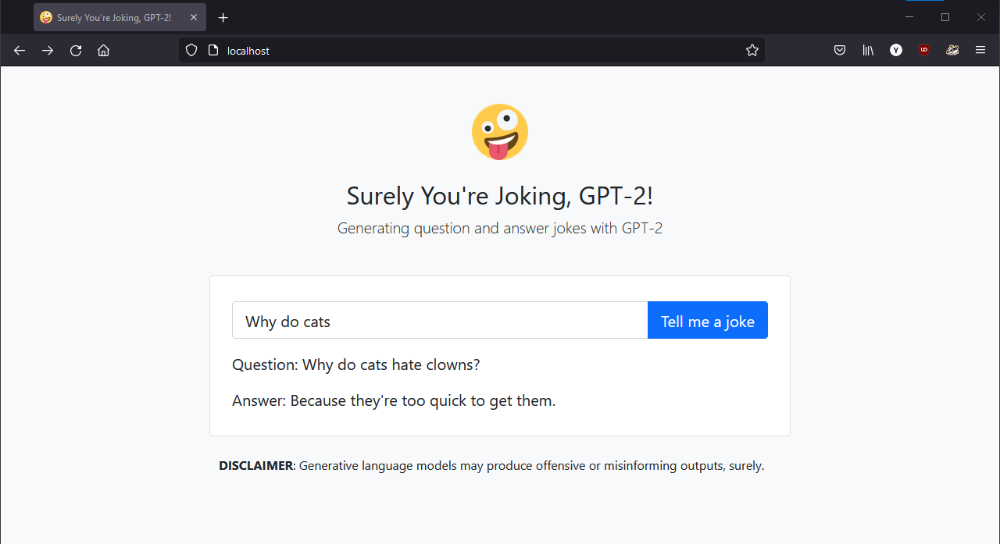
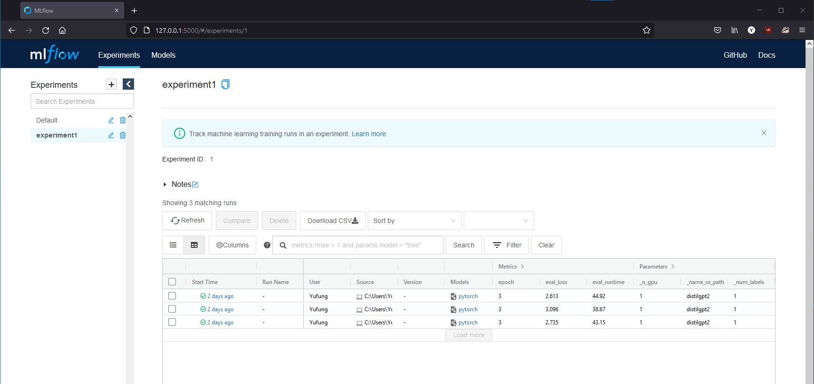
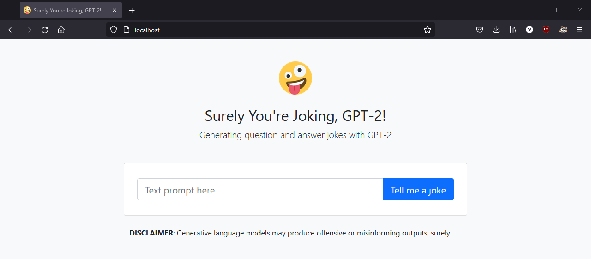
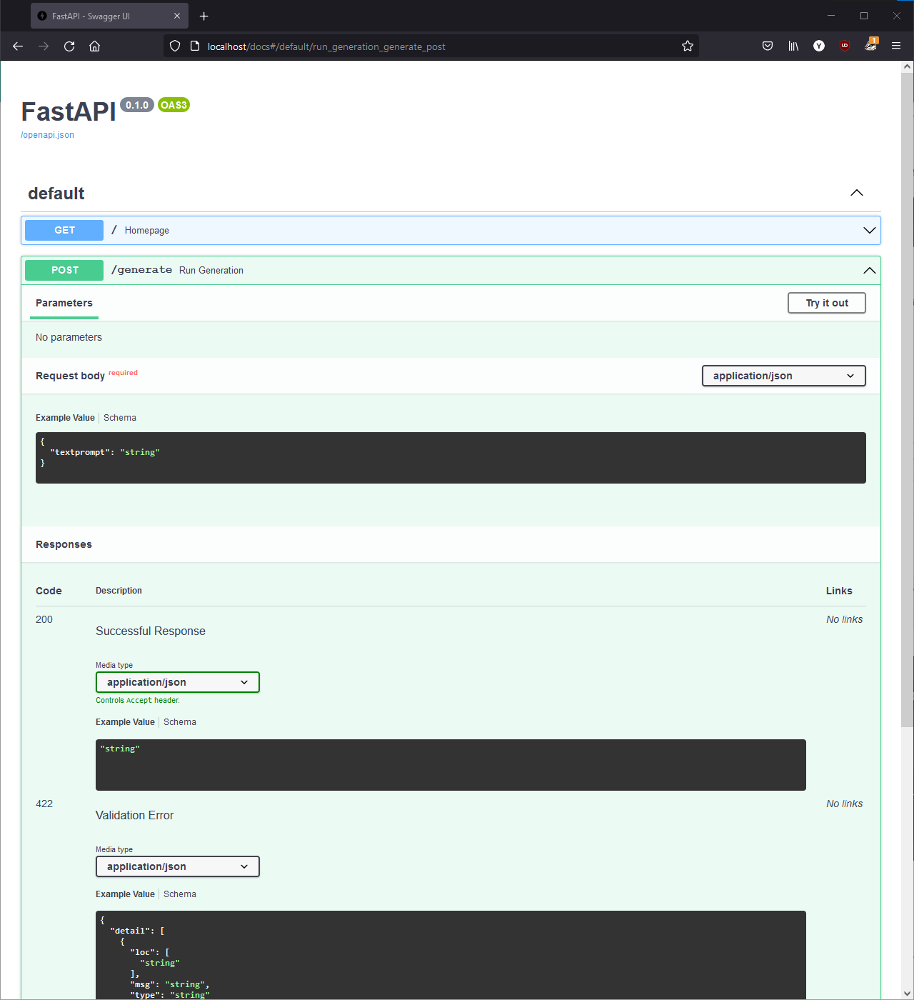

# GPT-2 the Joker
Generating question and answer jokes with GPT-2

<p align="center">

</p>

### Dataset

* Question-Answer Jokes from [Kaggle Datasets](https://www.kaggle.com/jiriroz/qa-jokes). It contains 38,269 jokes from end 2008 to 2016 in question-answer form that was obtained from the /r/Jokes subreddit.
* Reddit /r/Jokes from [Kaggle Datasets](https://www.kaggle.com/cuddlefish/reddit-rjokes). It contains 133,327 jokes from 2010 to February 2018 with score 5+. It has been parsed and formatted in question-answer form.

### Model

Pretrained tokenizer and language model from the Hugging Face [Transformers library](https://huggingface.co/transformers/index.html) was used. GPT-2 was chosen because it was trained with a causal language modeling (CLM) objective and is therefore powerful at predicting the next token in a sequence. The GPT-2 tokenizer was also adopted, which is based on byte-level Byte-Pair-Encoding (BPE). BPE iteratively tries to build new tokens out of the most frequent pairs of characters in a corpus and performs better on out of vocabularly words.

To speed up training and inference, DistilGPT2 and "fast" GPT-2 tokenizer was used. DistilGPT2 has fewer parameters compared to GPT2 (82M vs 124M) but is on average two times faster with comparable perplexity score on the WikiText-103 benchmark.

### Training

The pretrained model was fine-tuned on the jokes dataset over 3 epochs using a 90:10 train-test split. Three different permutations of special token used to join question and answer texts was tried. We evaluated the models on their perplexity score over our test set.

MLflow Tracking was used to record all experiments.

<p align="center">

</p>

### Deploy with Docker

* FastAPI with NGINX Unit for API and front-end service
* Celery for handling task scheduling
* Redis as backend and broker for Celery

Run the following command to build services and start containers:
```docker-compose -f deploy/docker-compose.yml up --build```

Two client services are available:

* HTML front-end that is accessible on `http://localhost`
* REST API endpoint via `http://localhost/generate`. API documentation accessible on `http://localhost/docs`

<p align="center">

</p>

<p align="center">

</p>
